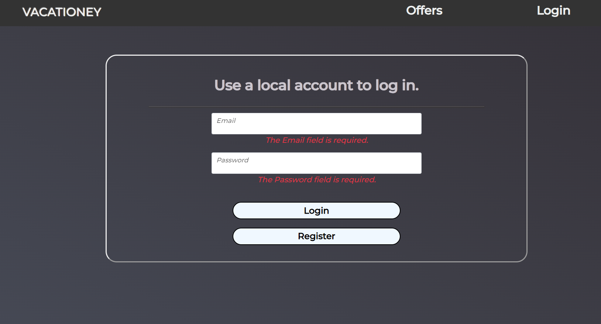
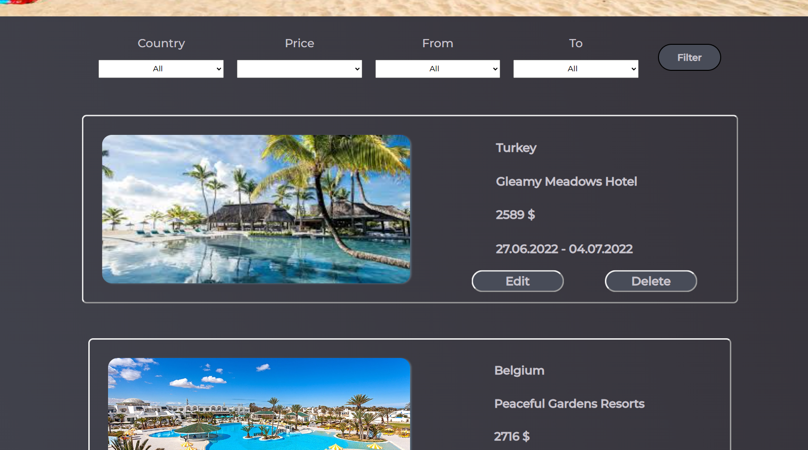
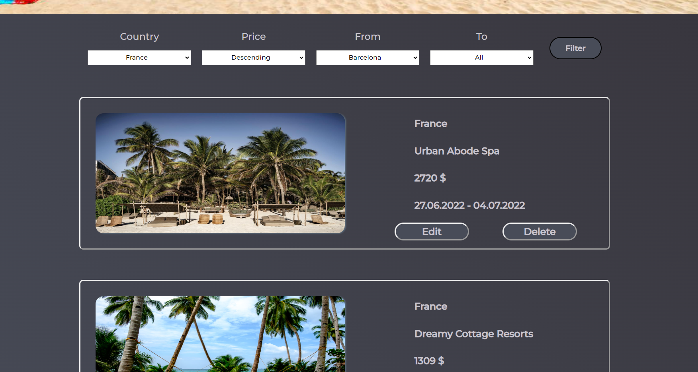

# Vacationey

Fictional company Vacationey is a travel agency.
This project is a user-friendly webpage providing functionality for this brand.
Potential client can search for the perfect offer in a desired location.

# Backend

### Technologies

- Visual Studio 2022
- .NET 6.0
- Entity Framework Core

### Instalation

Install necessary packages, they can be found in Dependencies -> Packages in project structure
Use Tools -> NuGet Package Manager -> Manage Nuget Packages for Solution

### Database

- SQLITE
- SQL SERVER

Provide correct connection string in appsettings.json file, add:

    "ConnectionStrings": {
        "SS-Connection": "Server=(localdb)\\mssqllocaldb;Database=Vacationey;Trusted_Connection=True;MultipleActiveResultSets=true",
        "SL-Connection": "Data Source=database.db;"
    }
and adjust Program.cs, providing adequate DbContext options:

#### For SQLITE

    builder.Services.AddDbContext<DatabaseContext>(options => options.UseSqlite(builder.Configuration.GetConnectionString("SL-Connection")));

#### For SQL-SERVER

    builder.Services.AddDbContext<DatabaseContext>(options => options.UseSqlServer(builder.Configuration.GetConnectionString("SS-Connection")));

and comment unneccesary part

In Visual Studio Run Tools -> NuGet Package Manager -> Package Manager Console and type:
* add-migration test_migration
* update-database

#### Entity Framework
Database is created with Code First approach using Entity Framework Core
DbContext model has a simple structure - four models with relations one-to-many:
* Country
* City
* Hotel
* Offer

Run project on your localhost through visual studio and find the best holidays for you

### Authentication 

User has an option to login, register and logout provided by AspNetCore.Identity
Views for these actions were modified to enhance user experience
Registered user can modify databse - edit, create and delete entities

## Pages

This action displays offers in databse.
Offer page as well as other pages supports filtering and is paginated

## Filters

Through fiters you can specify your requirements and query databse

## CRUD

All entities' controllers support CRUD operations - create, read, update, delete

## Routing

Webpage has a very intuitive layout, can be easily navigated through with buttons
Default routing: /Controller = Home/Action = Index/?id
Controllers:
* Home
* Offer
* Hotel
* City
* Country

Index action uses parameters for filtering database
Edit, Delete, Details views require id of the entity as a parameter
ex.:
* Hotel/Edit/12
* Offer/Index?countrySearch=Spain&page=1

# Frontend

Frontend was build using css and javascript
External libraries:
* JQuery
* Bootstrap